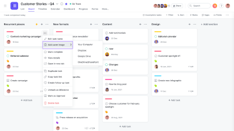

# Comparision of Asana and Trello

## Team: Blume
## Team Member: Ajay Narasimha Mopidevi

Project management tools are designed to support both individuals and teams to better plan, organize, and manage goals, projects, tasks from the ideation phase to the entire completion cycle. These tools capture the connections in the organization or a project of why, what, when and who of the work. Trello and Asana are popular planning tools, which provide a lot of capabilities to assist the team or individuals.  Trello[1,6] is a Kanban style-based project planning tool, having everything listed at one place and easy drag-and-drop of the cards.  Asana[2,3] is more traditional project management tool, providing multiple views and allowing larger teams to better collaborate between the projects and tasks.  

## Similarities:
**One space creation:** Both these tools allow the users to work with their preferred apps. They support most of the commonly used apps allowing users to turn mails/chart into actionable items and track their progress.

**Popularity:** Both these tools have millions of customers and being used in startups to Fortune 100 companies.

**Mobile Apps:** Other than the standard web app, both these tools provide mobile apps for both iOS and Android devices, allowing users to all the project information on the go. 

**Customization:** They cater the unique workflows and processes of the teams by providing more customization options for fields, tags, and workflows.

## Differences:
**Kanban board**[5]: Trello UI is completely based on visual kanban board, which allows all the users to have a glance at all the project details. While Asana also provides kanban board, it lacks the general kanban feel as it is focused on providing multiple views like List, Calendar, Timeline view.  With the **List** view providing the dependencies of the tasks in a project, and calendar view providing daily/weekly reminders of the tasks, Asana provides more flexibility to visualize the project. Users preferring standard kanban mostly prefer Trello over Asana.

 &nbsp;&nbsp;&nbsp;&nbsp;&nbsp;&nbsp;&nbsp;&nbsp;&nbsp;&nbsp;&nbsp;&nbsp;&nbsp;&nbsp;&nbsp;&nbsp;            

&nbsp;&nbsp;&nbsp;&nbsp;&nbsp;&nbsp;&nbsp;&nbsp;&nbsp;&nbsp;&nbsp;&nbsp;&nbsp;&nbsp;&nbsp;&nbsp;&nbsp;&nbsp;&nbsp;&nbsp;&nbsp;&nbsp;&nbsp;&nbsp; Trello Kanban board &nbsp;&nbsp;&nbsp;&nbsp;&nbsp;&nbsp;&nbsp;&nbsp;&nbsp;&nbsp;&nbsp;&nbsp;&nbsp;&nbsp;&nbsp;&nbsp;&nbsp;&nbsp;&nbsp;&nbsp;&nbsp;&nbsp;&nbsp;&nbsp;&nbsp;&nbsp;&nbsp;&nbsp;&nbsp;&nbsp;&nbsp;&nbsp;&nbsp;&nbsp;&nbsp;&nbsp;&nbsp;&nbsp;&nbsp;&nbsp;&nbsp;&nbsp;&nbsp;&nbsp;&nbsp;&nbsp;&nbsp;&nbsp;&nbsp;&nbsp;&nbsp;&nbsp;&nbsp;&nbsp;&nbsp;&nbsp;&nbsp;&nbsp;&nbsp;&nbsp;&nbsp;&nbsp;&nbsp;&nbsp;&nbsp;&nbsp;&nbsp;&nbsp;&nbsp;&nbsp;&nbsp;&nbsp;&nbsp;&nbsp;&nbsp;&nbsp;&nbsp;&nbsp;&nbsp;&nbsp; Asana Kanban board

**Team Size**[4]: Trello is majorly used by the individuals and small teams, while Asana is preferred in larger teams or organizations. The big limitation of Trello is it can't assign tasks to an individual, but instead have a member's card which notifies about the task progress. 

**Templates**[4]:  As Trello uses the traditional kanban structure, the templates only basic structure, with only options of headers. Asana provides more flexible options to templates to match the different views and pairs with automation workflows and app integrations.

**Analytics**[4]: Trello's standard reports only minimum info, mostly based on number of cards per user, due date, list etc. Asana provides a dashboard with various metrics charts and allowing users to add custom metrics.

**Automation cost**[4]: While both the tools support automation triggers for certain project actions. While there are no differences in automation capabilities, Trello provides these automations at a much lower price compared to Asana.  

**Ease of use**[5]: While both are easy to use, they might be complicated in few scenarios. It becomes complicated in Trello when you add a specific card that doesn't follow standard set of pipelines. For the Asana, it becomes complicated when you doesn't establish the tasks and sub-tasks properly.

To conclude, users working in small teams and preferring Kanban majorly use Trello. Better project visualizations, reporting, assigning tasks in highly required in larger teams, and they prefer Asana. As these differences are majorly in the UI and pricing, the choice of the tool is highly dependent on the specific needs and preferences of the users.

## References:
1. https://trello.com/
2. https://asana.com/
3. https://asana.com/resources
4. https://zapier.com/blog/trello-vs-asana/
5. https://www.forbes.com/advisor/business/software/asana-vs-trello/
6. https://friday.app/p/trello-overview
